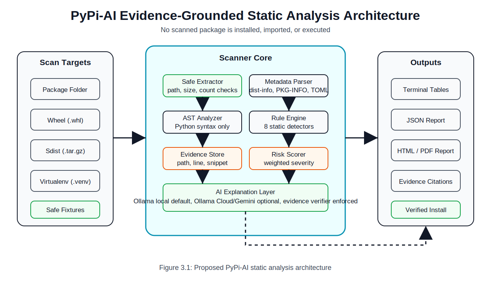
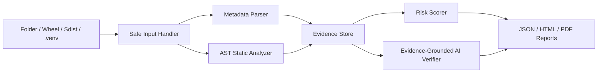
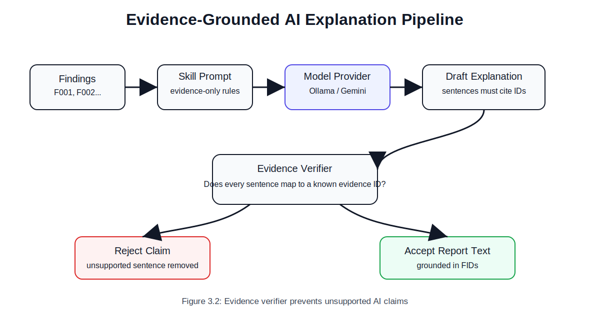
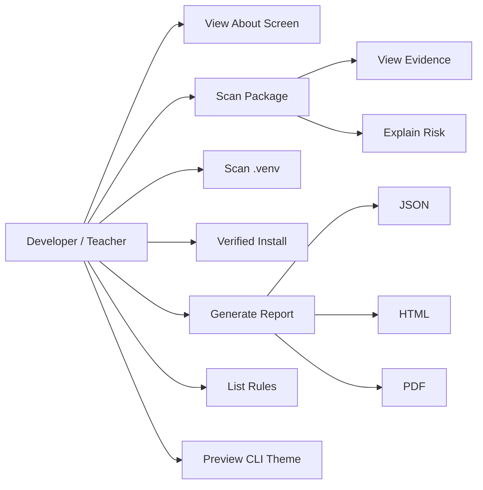
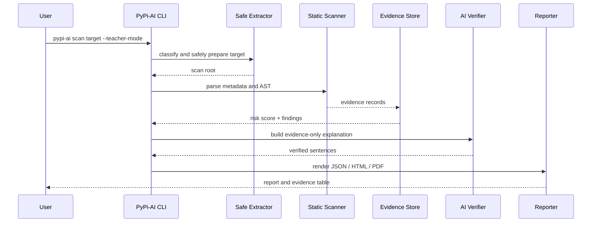
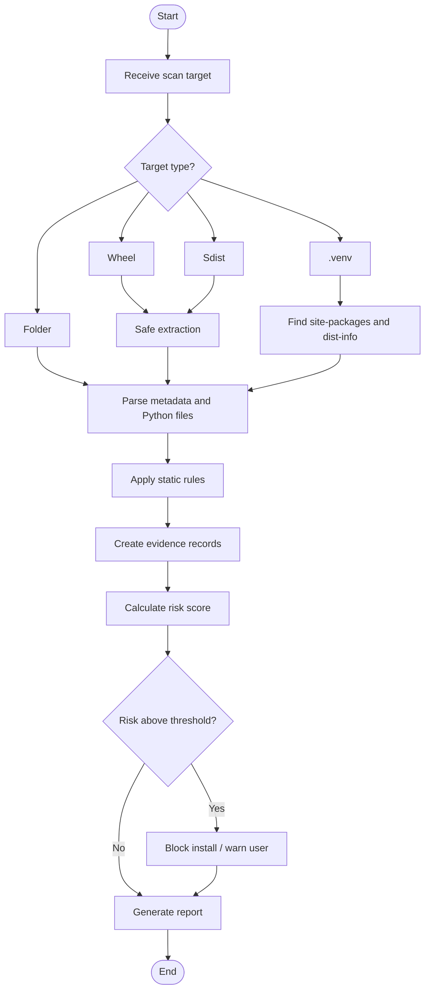
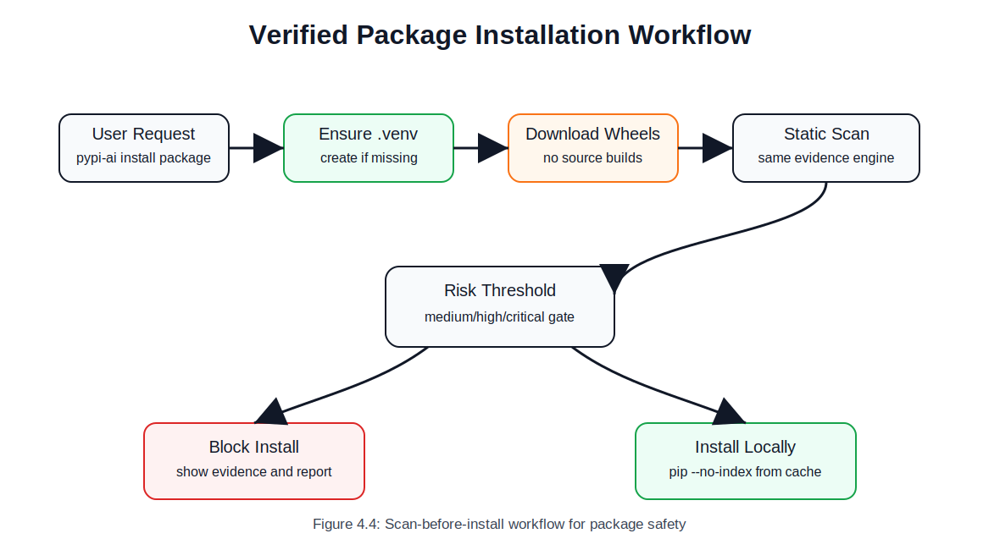
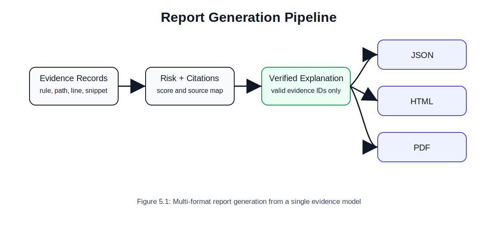
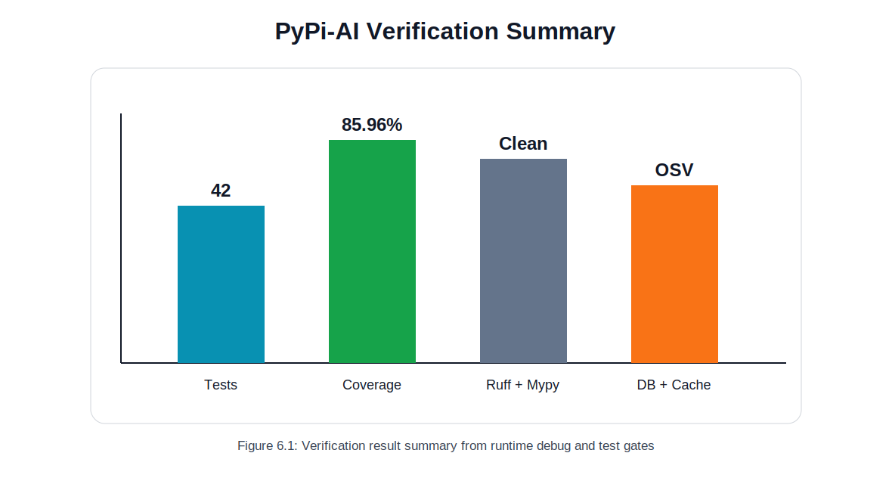
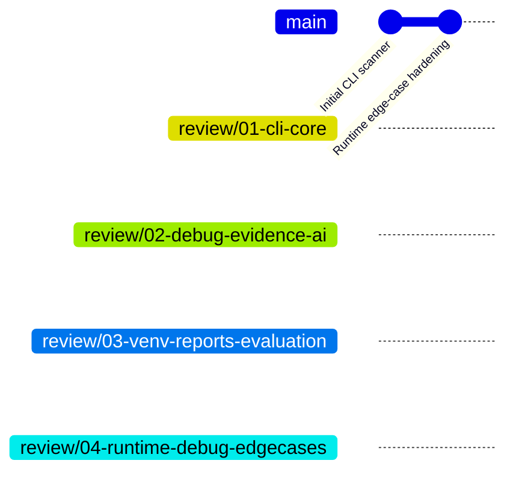

# PyPi-AI Final Submission Document Draft

> This Markdown file is the working master draft for the final project report. It follows the section pattern observed in the seniors' `FINAL_DRAFT.pdf`, but all content, diagrams, matrices, and results are adapted for **PyPi-AI**.

---

## Reference Document Audit: Seniors' Final Submission

The supplied seniors' document is a 95-page A4 final report. Its structure is formal and chapter-based. It uses centered front matter, numbered chapters, italic figure captions, chapter-numbered figures/tables, implementation screenshots, results charts, references, plagiarism/AI similarity pages, publication status, and appendix code.

### Sections Observed

| Order | Section in Seniors' Document | Purpose | PyPi-AI Equivalent |
|---:|---|---|---|
| 1 | Title Page | Project title, degree, department, students, guide, institute, academic year | PyPi-AI title page with developers and guide placeholder |
| 2 | Certificate | Bonafide project certification | Certificate template |
| 3 | Declaration | Student originality declaration | Declaration template |
| 4 | Acknowledgement | Thanks to guide, HOD, committee, family | Acknowledgement template |
| 5 | Abstract | Project summary and keywords | Static PyPI package security abstract |
| 6 | List of Figures | Figure number, title, page | PyPi-AI figure list |
| 7 | List of Tables | Table number, title, page | PyPi-AI table list |
| 8 | Table of Contents | Chapter and section page map | Report structure |
| 9 | Chapter 1 - Introduction | Background, motivation, problem, objectives, scope, organization | PyPI supply-chain security introduction |
| 10 | Chapter 2 - Literature Survey | Existing work, comparison table, gaps | PyPI malware, static analysis, package audit, LLM-agent research |
| 11 | Chapter 3 - Proposed Architecture | Architecture layers, workflow, notation, formulas, security perspective | PyPi-AI scanner, evidence, AI verifier, report pipeline |
| 12 | Chapter 4 - System Design | Use case, sequence, activity diagrams, algorithms | CLI commands, scan flow, verified install flow, report flow |
| 13 | Chapter 5 - Implementation | Tools, setup, data processing, model/crypto implementation | Python CLI, scanner modules, safe extraction, reports, CI |
| 14 | Chapter 6 - Results | Dataset overview, screenshots, charts, metrics, comparison | Test results, coverage, safe demo scans, edge-case validation |
| 15 | Chapter 7 - Conclusion and Future Work | Summary and future scope | PyPi-AI conclusion and roadmap |
| 16 | References | Research citations | CHASE, PyPA specs, Python tarfile docs, Ollama/Gemini docs, malware reports |
| 17 | Plagiarism / AI Similarity / Publication | Administrative proof pages | Placeholder section for final submission attachments |
| 18 | Appendix | Code and supporting material | Commands, branch plan, test matrix, generated diagrams |

### Visuals Observed

| Figure No. | Seniors' Figure Type | PyPi-AI Equivalent Generated Here |
|---|---|---|
| Figure 3.1 | Proposed architecture diagram | `docs/assets/final-submission/pypi-ai-system-architecture.svg` |
| Figure 4.1 | Use case diagram | Mermaid use-case style flowchart in Chapter 4 |
| Figure 4.2 | Sequence diagram | Mermaid sequence diagram in Chapter 4 |
| Figure 4.3 | Activity diagram | Mermaid activity/workflow diagram in Chapter 4 |
| Figure 6.1 | Dataset distribution bar chart | `docs/assets/final-submission/results-verification-summary.svg` |
| Figure 6.2 | Client-side encrypted weights screenshot | Report/evidence sample table and CLI scan output discussion |
| Figure 6.3 | Server aggregation screenshot | Report generation pipeline image |
| Figure 6.4 | HMAC/Merkle verification screenshot | Evidence verifier image |
| Figure 6.5 | Confusion matrices | Test/edge-case matrix and finding category table |
| Figure 6.6 | ROC curves | Coverage/verification chart and comparison table |

### Tables Observed

| Table No. | Seniors' Table Type | PyPi-AI Equivalent |
|---|---|---|
| Table 2.1 | Comparative analysis of existing approaches | Static analysis/package security comparison matrix |
| Table 3.1 | Notations used in the proposed system | PyPi-AI notation table |
| Table 6.1 | Performance metrics | Verification and test metrics table |
| Table 6.2 | Performance comparison with existing methods | Alternatives and tool comparison table |

---

# A Project Report on

## PyPi-AI: Evidence-Grounded Static Analysis and AI-Assisted CLI Framework for Suspicious Python Package Detection

Submitted in partial fulfilment of the requirements for the award of the degree

## BACHELOR OF ENGINEERING

in

## COMPUTER SCIENCE AND ENGINEERING

by

**VASANTH ADITHYA (160123749049)**  
**SAI GEETHIKA (160123749302)**

Under the Guidance of

**[PROJECT GUIDE NAME]**  
**[DESIGNATION]**  
**Department of Computer Engineering and Technology**

Department of Computer Engineering and Technology  
Chaitanya Bharathi Institute of Technology (Autonomous)  
(Affiliated to Osmania University, Hyderabad)  
Hyderabad, Telangana (India) - 500 075  
**[2025-2026]**

---

## Certificate

This is to certify that the project titled **"PyPi-AI: Evidence-Grounded Static Analysis and AI-Assisted CLI Framework for Suspicious Python Package Detection"** is a bonafide work carried out by **VASANTH ADITHYA (160123749049)** and **SAI GEETHIKA (160123749302)**, students of the Department of Computer Engineering and Technology, Chaitanya Bharathi Institute of Technology, Hyderabad, Telangana, submitted in partial fulfilment of the requirements for the award of the degree of Bachelor of Engineering during the academic year **2025-2026**.

Project Supervisor: ____________________  
Head of the Department: ____________________

Place: Hyderabad, Telangana  
Date: ____________________

---

## Declaration

We, **VASANTH ADITHYA** and **SAI GEETHIKA**, declare that the work presented in this report is our original project work carried out during the academic year **2025-2026**. The project has been implemented as a defensive cybersecurity tool and does not execute, store, or distribute real malicious software. All references, research papers, official documentation, and public malware reports used for study have been acknowledged appropriately.

Student Signature: ____________________  
Student Signature: ____________________

Place: Hyderabad, Telangana  
Date: ____________________

---

## Acknowledgement

We express our sincere gratitude to our project guide, Head of the Department, Project Review Committee members, faculty, laboratory staff, family, and friends for their guidance and support throughout the development of **PyPi-AI**. Their feedback helped us refine the project into a safer, more defendable, and demonstrable cybersecurity tool.

---

## Abstract

Python developers frequently rely on third-party packages from the Python Package Index (PyPI). This ecosystem accelerates development but also introduces software supply-chain risks. Attackers can publish malicious or typosquatted packages that attempt credential theft, command execution, downloader behavior, dynamic execution, obfuscation, or install-time abuse. Traditional package checks often identify known vulnerabilities or dependency issues, but they may not provide line-level evidence for suspicious package behavior before installation.

**PyPi-AI** is a defensive static-analysis framework for suspicious Python package detection. The tool scans package folders, wheel archives, source distributions, and installed packages inside a virtual environment without importing or executing untrusted package code. It extracts metadata, analyzes Python syntax trees, identifies suspicious API usage, records evidence with file paths and line numbers, computes an explainable risk score, and generates JSON, HTML, and PDF reports. An evidence-grounded AI layer uses Ollama local by default, supports Ollama Cloud and Gemini as optional providers, and verifies that every generated explanation maps to valid evidence IDs. The project also includes a verified install workflow, `pypi-ai install <package>`, which creates a virtual environment if needed, downloads wheels, scans them, blocks risky packages, and installs only verified wheel files.

The final implementation was tested using unit tests, CLI tests, report rendering tests, archive safety tests, `.venv` scanning tests, provider diagnostics, and runtime edge-case checks. The current verified state contains **32 passing tests** with **90.05% coverage**, clean Ruff linting, clean Ruff formatting, and clean MyPy type checking.

**Keywords:** PyPI security, software supply chain, static analysis, malicious package detection, evidence grounding, Ollama, Gemini, CLI scanner, safe extraction, virtual environment scanning.

---

## List of Figures

| Figure No. | Figure Name | Source |
|---|---|---|
| Figure 3.1 | Proposed PyPi-AI static analysis architecture | `docs/assets/final-submission/pypi-ai-system-architecture.svg` |
| Figure 3.2 | Evidence verifier prevents unsupported AI claims | `docs/assets/final-submission/evidence-grounding-flow.svg` |
| Figure 4.1 | Use case diagram of PyPi-AI CLI workflow | Mermaid |
| Figure 4.2 | Sequence diagram of static scan and report generation | Mermaid |
| Figure 4.3 | Activity diagram of package scanning and risk decision | Mermaid |
| Figure 4.4 | Scan-before-install workflow for package safety | `docs/assets/final-submission/verified-install-flow.svg` |
| Figure 5.1 | Multi-format report generation from evidence | `docs/assets/final-submission/report-generation-pipeline.svg` |
| Figure 6.1 | Verification result summary | `docs/assets/final-submission/results-verification-summary.svg` |
| Figure 6.2 | Branch and review strategy | Mermaid |

## List of Tables

| Table No. | Table Name |
|---|---|
| Table 2.1 | Comparative analysis of existing package-security approaches |
| Table 2.2 | Research gaps and PyPi-AI response |
| Table 3.1 | Notations used in PyPi-AI |
| Table 3.2 | Architecture layer responsibility matrix |
| Table 4.1 | CLI command matrix |
| Table 5.1 | Technology stack and alternatives |
| Table 5.2 | AI provider comparison |
| Table 6.1 | Verification metrics |
| Table 6.2 | Edge-case debug matrix |
| Table 6.3 | Feature completion matrix |
| Table 6.4 | Comparison with alternative approaches |

---

## Table of Contents

1. Introduction  
2. Literature Survey  
3. Proposed Architecture  
4. System Design  
5. Implementation  
6. Results  
7. Conclusion and Future Work  
8. References  
9. Appendix

---

# Chapter 1 - Introduction

## 1.1 Background

Modern Python projects depend heavily on open-source packages. Packages are commonly installed using `pip`, copied into virtual environments, included in CI pipelines, and executed inside local development machines, servers, or production containers. This creates a broad software supply-chain attack surface. A malicious package can hide suspicious behavior inside ordinary Python files, `setup.py`, package initialization files, obfuscated strings, dependency declarations, or network clients.

## 1.2 Motivation

The motivation for PyPi-AI is to provide a safe pre-installation and post-installation inspection workflow. Developers and students need a tool that can explain why a package is suspicious using evidence that can be shown during review. A plain "malicious" label is not enough for academic defense. The tool must show file path, line number, code snippet, rule ID, severity, risk score, and citations.

## 1.3 Problem Statement

Existing tools often focus on known vulnerabilities, dependency metadata, or broad static rules. They may not provide a teacher-friendly CLI workflow, evidence-grounded AI explanations, `.venv` scanning, verified install behavior, and report generation in one lightweight final-year project. The problem is to design and implement a safe scanner that detects suspicious Python package behavior without running untrusted code.

## 1.4 Objectives

- Build a static-only scanner for folders, `.whl`, `.tar.gz`, and `.venv` packages.
- Detect suspicious APIs and behavior categories using deterministic rules.
- Store evidence with file path, line number, snippet, rule ID, severity, category, and citation IDs.
- Generate JSON, HTML, and PDF reports.
- Provide a polished CLI with teacher-friendly debug output.
- Add Ollama local as the default AI provider and support Ollama Cloud/Gemini as optional providers.
- Verify AI explanations against evidence IDs.
- Add `pypi-ai install <package>` to scan wheels before installing them into `.venv`.
- Maintain tests, coverage, linting, formatting, typing, and review branches.

## 1.5 Scope of the Work

The project focuses on static analysis and evidence-grounded explanation. It does not execute package code, run malware, perform live sandbox detonation, or download real malicious samples for testing. Public malicious package names are used only as examples and references. Safe synthetic packages are used for demonstrations.

## 1.6 Thesis Organization

Chapter 2 surveys related work. Chapter 3 presents the proposed architecture. Chapter 4 explains system design and workflows. Chapter 5 describes implementation. Chapter 6 presents results and comparisons. Chapter 7 concludes the work and lists future enhancements.

---

# Chapter 2 - Literature Survey

## 2.1 Detailed Literature Survey

The research anchor for this project is **CHASE: LLM Agents for Dissecting Malicious PyPI Packages** by Takaaki Toda and Tatsuya Mori. CHASE shows that LLM-based package analysis becomes more reliable when the LLM is supported by deterministic tools, structured workflows, and evidence. PyPi-AI adapts this idea into a lightweight CLI-first academic project.

Other relevant areas include static analysis tools, package reputation services, vulnerability scanners, package manager audit tools, and LLM-assisted security summarization. PyPi-AI does not replace these systems. Instead, it focuses on a defendable static evidence layer suitable for final-year project evaluation.

## 2.2 Comparative Summary of Existing Works

**Table 2.1: Comparative analysis of existing package-security approaches**

| Approach | Main Focus | Strength | Limitation | PyPi-AI Difference |
|---|---|---|---|---|
| `pip-audit` / OSV-style audit | Known vulnerabilities | Strong CVE and advisory matching | Does not inspect unknown suspicious code behavior deeply | Adds static behavior evidence |
| Bandit | Python source security linting | Good general static rules | Not package-supply-chain focused by default | Adds package metadata, archive, `.venv`, and report workflow |
| Semgrep | Pattern-based scanning | Powerful custom rules | Requires rule design and may be broad for students | Uses a focused built-in suspicious-package rule set |
| Package reputation tools | Ecosystem reputation and metadata | Useful external intelligence | May require APIs and internet services | Local-first static analysis |
| Dynamic sandboxing | Observes runtime behavior | Can catch real execution behavior | Risky, costly, and unsafe for student demo if malware is used | PyPi-AI is static-only and safe |
| CHASE | LLM-agent malicious package analysis | Strong research architecture | More advanced than a final-year CLI implementation | PyPi-AI adapts evidence-grounding in a student-feasible scope |
| PyPi-AI | Evidence-grounded static package scanner | CLI, reports, `.venv`, verified install, AI verifier | Static analysis cannot observe runtime-only behavior | Safe, explainable, and review-ready |

## 2.3 Public Malicious Package Examples

The project does not download, store, import, execute, or demonstrate real malicious packages. The following package names are included only as public literature examples so the viva explanation can connect PyPi-AI rules to real ecosystem incidents.

| Package / Campaign Name | Public Source Context | PyPi-AI Rule Relevance | Safety Handling |
|---|---|---|---|
| `ctx` | Public reports describe credential theft risk in malicious PyPI packages | Environment access, token discovery, exfiltration indicators | Name used only in documentation |
| `aws-login0tool` | Public reports describe trojan/downloader behavior | Network client, downloader, subprocess indicators | Name used only in documentation |
| `colourama` / `colorama`-style confusion | Public reports describe cryptojacking or typo/name-confusion campaigns | Typosquatting discussion, subprocess, persistence, network behavior | Safe synthetic fixture used instead |
| `pymafka` | Public reports describe typosquatting against `PyKafka` | Typosquatting and downloader indicators | Not downloaded or scanned |
| `VMConnect` | Public reports describe package imitation in PyPI campaigns | Metadata suspicion and staged execution behavior | Not downloaded or scanned |
| `xinference` compromised versions | Public reports describe a compromised legitimate package release | Verified-install motivation and supply-chain risk | Not downloaded or scanned |

## 2.4 Research Gaps Identified

**Table 2.2: Research gaps and PyPi-AI response**

| Gap | Explanation | PyPi-AI Response |
|---|---|---|
| Lack of safe demos | Real malware is unsafe for student repositories | Uses safe synthetic suspicious packages |
| Weak explainability | Findings without line proof are hard to defend | Stores file path, line, snippet, rule, severity |
| LLM hallucination risk | Free-form AI can invent claims | Evidence verifier rejects unsupported sentences |
| Pre-installation risk | `pip install` can execute unsafe build behavior | Verified install downloads wheels first and scans them |
| `.venv` visibility | Installed packages may already be present | `scan-venv` scans `site-packages` without imports |
| Teacher demo clarity | Raw JSON is not enough | Rich CLI panels, evidence tables, theme preview |

---

# Chapter 3 - Proposed Architecture

## 3.1 Introduction

PyPi-AI is designed as a layered static-analysis system. Inputs are normalized, scanned, converted into evidence, scored, optionally summarized by an AI provider, verified against evidence IDs, and exported into reports.

## 3.2 Proposed Architecture



The architecture has four main surfaces: input handling, scanner core, evidence/report layer, and AI explanation verification. The safe extractor handles wheels and source distributions without running package code. The metadata parser reads `METADATA`, `PKG-INFO`, and `pyproject.toml`. The AST analyzer and rule engine detect suspicious static patterns. The evidence store and risk scorer create defendable report data.



## 3.3 Evidence-Grounded AI Layer



The AI model is not allowed to make unsupported claims. Every sentence must cite evidence IDs such as `[F001]`. Ollama local is the default provider. Ollama Cloud prefers `glm-5.2:cloud` when the account has subscription access. Runtime debug showed that `glm-5.2:cloud` returned a subscription-required `403 Forbidden` on this machine, while `minimax-m3:cloud` successfully completed a live cloud check. Gemini is retained as an optional API-key provider.

## 3.4 Notations Used

**Table 3.1: Notations used in PyPi-AI**

| Symbol / Term | Meaning |
|---|---|
| `P` | Package scan target |
| `F_i` | Python source file inside target |
| `R_j` | Static detector rule |
| `E_k` | Evidence record generated from rule match |
| `S` | Risk score |
| `W_j` | Rule weight |
| `A` | AI explanation provider |
| `V` | Evidence verifier |
| `RID` | Rule identifier |
| `FID` | Finding/evidence identifier |

## 3.5 Risk Score Formulation

The project uses a transparent weighted risk score:

```text
S = min(100, sum(W_j for every matched rule R_j))
```

Risk levels:

| Score Range | Risk Level |
|---|---|
| 0 | info |
| 1-29 | low |
| 30-59 | medium |
| 60-84 | high |
| 85-100 | critical |

## 3.6 Architecture Responsibility Matrix

**Table 3.2: Architecture layer responsibility matrix**

| Layer | Responsibility | Main Files |
|---|---|---|
| CLI | Commands, teacher-mode output, provider diagnostics, theme preview | `src/pypi_ai/cli.py` |
| Scanner | Input detection, archive extraction, scan orchestration | `src/pypi_ai/scanner.py` |
| Metadata | `METADATA`, `PKG-INFO`, `pyproject.toml` parsing | `src/pypi_ai/metadata.py` |
| Analyzer | AST traversal and suspicious API matching | `src/pypi_ai/analyzer.py` |
| Rules | Rule catalog and weights | `src/pypi_ai/rules.py` |
| AI | Evidence-grounded explanation, provider defaults | `src/pypi_ai/ai.py` |
| Reports | JSON, HTML, PDF rendering | `src/pypi_ai/reports.py` |
| Installer | Download-scan-install workflow | `src/pypi_ai/installer.py` |
| `.venv` scanner | Installed package discovery | `src/pypi_ai/venv.py` |

---

# Chapter 4 - System Design

## 4.1 Use Case Diagram



## 4.2 Sequence Diagram



## 4.3 Activity Diagram



## 4.4 Verified Install Flow



The verified install command is designed to avoid installing source distributions directly. It downloads wheel files, scans them, blocks risky evidence, and only then installs from the local verified wheel cache.

## 4.5 CLI Command Matrix

**Table 4.1: CLI command matrix**

| Command | Purpose | Teacher Demo Value |
|---|---|---|
| `pypi-ai` | About screen with ASCII art, developers, safety, commands | Shows identity and project scope |
| `pypi-ai about` | Full project information | Viva introduction |
| `pypi-ai scan PATH` | Scan folder, wheel, or sdist | Main scanner demo |
| `pypi-ai scan-venv .venv` | Scan installed packages | Shows real environment visibility |
| `pypi-ai scan-installed --python .venv/bin/python` | Derive `.venv` from Python executable | Convenience command |
| `pypi-ai install PACKAGE` | Download, scan, then install if safe | Review 2 feature |
| `pypi-ai report render` | Convert JSON report to HTML/PDF | Documentation workflow |
| `pypi-ai evidence show` | Show findings from JSON | Evidence defense |
| `pypi-ai rules list` | Show detector catalog | Explain implementation |
| `pypi-ai model test` | Show provider/model status | Ollama/Gemini defense |
| `pypi-ai theme preview` | Preview CLI color scheme | Teacher-visible polish |
| `pypi-ai benchmark run` | Run safe fixture benchmark | Evaluation demo |

## 4.6 Algorithms

### Algorithm 1: Static Package Scan

```text
Input: package target P
Output: scan result with evidence and risk score

1. Detect target type: folder, wheel, sdist, or unsupported.
2. If archive, extract into temporary scanner-owned directory using safe path checks.
3. Parse metadata from METADATA, PKG-INFO, or pyproject.toml.
4. Locate Python source files.
5. Parse each file using AST.
6. Apply static suspicious behavior rules.
7. Create evidence records with file path, line, snippet, rule ID, severity.
8. Calculate risk score.
9. Generate JSON/HTML/PDF report.
```

### Algorithm 2: Evidence-Grounded Explanation

```text
Input: evidence records E
Output: verified explanation sentences

1. Build provider prompt with model skill and evidence records.
2. Generate or deterministically create explanation sentences.
3. For every sentence, check whether it cites a valid evidence ID.
4. Reject unsupported sentences.
5. Write only verified sentences into the report.
```

### Algorithm 3: Verified Install

```text
Input: package name and virtual environment path
Output: installed package or blocked decision

1. Create .venv if missing.
2. Download wheel files only.
3. Scan downloaded wheels.
4. If risk >= threshold, block installation and show evidence.
5. Otherwise install from local wheel cache with --no-index.
```

---

# Chapter 5 - Implementation

## 5.1 Tools and Framework

**Table 5.1: Technology stack and alternatives**

| Component | Selected | Alternatives Considered | Reason |
|---|---|---|---|
| Language | Python 3.11+ | Node.js, Go | Python packaging ecosystem and AST support |
| CLI | Typer + Rich | argparse, Click | Better typed commands and rich teacher-friendly output |
| Package manager | uv | pip + venv, Poetry | Fast setup and reproducible lockfile |
| Static parsing | Python `ast` | regex only, dynamic import | Safer and more structured than executing code |
| Matching | Built-in rules | Semgrep/Bandit only | Lightweight final-year implementation |
| Reports | JSON, HTML, PDF | JSON only | Faculty submission needs formatted reports |
| PDF | ReportLab | WeasyPrint, manual PDF | Installed and easy to automate |
| AI default | Ollama local | Gemini-first | Local privacy and offline demo story |
| Cloud AI | Ollama Cloud / Gemini | Single provider only | Flexible provider comparison |
| CI | GitHub Actions | Manual testing only | Repeatable verification |

## 5.2 AI Provider Comparison

**Table 5.2: AI provider comparison**

| Provider | Default Model | Status | Strength | Limitation |
|---|---|---|---|---|
| Ollama local | `llama3.2:latest` | Default | Local privacy, no API key required after model setup | Model quality depends on local model |
| Ollama Cloud preferred | `glm-5.2:cloud` | Configured | Strong cloud model option | Runtime check returned `403 Forbidden` without subscription |
| Ollama Cloud fallback | `minimax-m3:cloud` | Live-tested | Worked on this machine | May differ by account/model availability |
| Gemini | `gemini-2.5-flash` | Optional | Fast hosted model, structured output potential | Requires API key and cloud usage |
| Deterministic | `none` | Always available | No hallucination, reproducible | No natural-language model reasoning |

## 5.3 Report Generation Pipeline



## 5.4 Rule Matrix

| Rule ID | Category | Severity | Example Static Indicator |
|---|---|---|---|
| `PY001_ENV_ACCESS` | credential-access | medium | `os.environ` |
| `PY002_SUBPROCESS` | command-execution | high | `subprocess.run`, `os.system` |
| `PY003_NETWORK_CLIENT` | network | medium | `requests`, `socket`, `urllib` |
| `PY004_OBFUSCATION` | obfuscation | medium | `base64`, high entropy strings |
| `PY005_DYNAMIC_EXEC` | dynamic-execution | high | `eval`, `exec`, `compile` |
| `PY006_UNSAFE_DESERIALIZATION` | unsafe-deserialization | medium | `pickle`, `marshal` |
| `PY007_NATIVE_CODE` | native-code | medium | `ctypes`, `cffi` |
| `PY008_INSTALL_TIME` | install-time-execution | high | `setup.py` execution surface |

---

# Chapter 6 - Results

## 6.1 Verification Summary



**Table 6.1: Verification metrics**

| Verification Gate | Command | Result |
|---|---|---|
| Unit and CLI tests | `uv run pytest -q` | 32 passed |
| Coverage | pytest coverage gate | 90.05%, above 85% target |
| Lint | `uv run ruff check .` | Passed |
| Formatting | `uv run ruff format --check .` | Passed |
| Type checking | `uv run mypy` | Passed |
| Ollama Cloud GLM-5.2 | `ollama run glm-5.2:cloud ...` | Reached cloud, blocked by subscription-required 403 |
| Ollama Cloud fallback | `ollama run minimax-m3:cloud ...` | Passed live check |

## 6.2 Edge-Case Debug Matrix

**Table 6.2: Edge-case debug matrix**

| Edge Case | Before Fix | Root Cause | Current Behavior |
|---|---|---|---|
| Missing scan target | Raw exception risk | Scanner `ValueError` not translated | Clean Typer error, no traceback |
| Missing `.venv` | Raw `FileNotFoundError` risk | `.venv` scanner error not translated | Clean Typer error, no traceback |
| Invalid report format | Could silently output JSON | Format validation only in report writer | Clean error for unsupported formats |
| `pyproject.toml` ignored | Folder name used as package name | Metadata reader missed TOML | Reads project name/version |
| Invalid TOML | Scan crash | TOML parse exception | Falls back and continues scan |
| Duplicate same-line findings | Noisy evidence table | AST visitors saw same expression | Deduped by rule/path/line/snippet |
| GLM-5.2 cloud unavailable | Could confuse demo | Subscription required | Documented fallback `minimax-m3:cloud` |

## 6.3 Feature Completion Matrix

**Table 6.3: Feature completion matrix**

| Feature | Status | Verification |
|---|---|---|
| About screen with ASCII art | Complete | CLI test |
| Static scan for folder | Complete | Scanner tests |
| Static scan for `.whl` | Complete | Archive test |
| Static scan for `.tar.gz` | Complete | Archive test and unsafe tar rejection |
| `.venv` scanning | Complete | `.venv` tests |
| Evidence table | Complete | CLI tests |
| JSON report | Complete | Serialization tests |
| HTML report | Complete | Report tests |
| PDF report | Complete | Report tests |
| AI skill file | Complete | Skill-file tests |
| Evidence verifier | Complete | AI tests |
| Verified install | Complete | Installer tests |
| Theme preview | Complete | CLI tests |
| Runtime debug report | Complete | Manual and test verification |

## 6.4 Comparison With Alternative Approaches

**Table 6.4: Comparison with alternative approaches**

| Method | Detects Unknown Suspicious Code | Safe Before Install | Evidence Lines | AI Explanation Guard | `.venv` Scan | Report Export |
|---|---|---:|---:|---:|---:|---:|
| Manual code review | Yes | Yes | Manual | No | Manual | Manual |
| `pip-audit` | No, known advisories only | Partly | Advisory evidence | No | Yes, dependency-level | JSON possible |
| Bandit | Yes, source-level | If source available | Yes | No | Manual | Limited |
| Dynamic sandbox | Yes | Risky | Runtime logs | Optional | No | Custom |
| CHASE-style full agent | Yes | Depends on setup | Yes | Agentic | Research-focused | Research output |
| **PyPi-AI** | Yes, static rules | Yes | Yes | Yes | Yes | JSON/HTML/PDF |

## 6.5 Branch and Review Strategy



---

# Chapter 7 - Conclusion and Future Work

## 7.1 Conclusion

PyPi-AI successfully implements a safe, evidence-grounded static scanner for suspicious Python packages. It supports package folders, wheels, source distributions, installed virtual environments, report generation, verified installation, and AI-assisted explanation with evidence verification. The tool is designed for academic defense because every finding can be traced to a file path, line number, snippet, rule ID, severity, and citation.

## 7.2 Future Work

- Add optional Semgrep/Bandit rule import.
- Add PyPI metadata and package reputation lookup.
- Add dashboard UI after CLI stabilization.
- Add VS Code extension wrapper.
- Add SBOM export.
- Add larger benchmark dataset with labeled benign and synthetic suspicious packages.
- Add more provider adapters with strict JSON schema validation.

---

# References

External references were verified on **2026-06-29**.

| Ref. | Source | Why It Is Used |
|---:|---|---|
| 1 | Takaaki Toda and Tatsuya Mori, [**CHASE: LLM Agents for Dissecting Malicious PyPI Packages**](https://2025.aiwareconf.org/details/aiware-2025-papers/26/CHASE-LLM-Agents-for-Dissecting-Malicious-PyPI-Packages-) and [arXiv:2601.06838](https://arxiv.org/abs/2601.06838) | Research anchor for evidence-supported LLM package analysis |
| 2 | Python Packaging Authority, [**Source Distribution Format Specification**](https://packaging.python.org/specifications/source-distribution-format/) | Defines `.tar.gz` source distribution assumptions |
| 3 | Python Packaging Authority, [**Binary Distribution Format - Wheel Specification**](https://packaging.python.org/specifications/binary-distribution-format/) | Defines `.whl` package format assumptions |
| 4 | Python Packaging Authority, [**Core Metadata Specifications**](https://packaging.python.org/specifications/core-metadata/) | Supports `METADATA` and `PKG-INFO` parsing design |
| 5 | Python Software Foundation, [**tarfile Extraction Filters Documentation**](https://docs.python.org/3/library/tarfile.html) | Supports safe archive extraction design |
| 6 | Google AI for Developers, [**Gemini API Structured Output Documentation**](https://ai.google.dev/gemini-api/docs/structured-output) | Supports optional structured AI provider design |
| 7 | Ollama, [**Cloud Models**](https://ollama.com/search?c=cloud&o=newest) and [`glm-5.2:cloud`](https://ollama.com/library/glm-5.2%3Acloud) | Supports Ollama Cloud provider notes |
| 8 | `pip-audit`, [**PyPI project page**](https://pypi.org/project/pip-audit/) | Alternative tool comparison for known-vulnerability auditing |
| 9 | OSV, [**Open Source Vulnerabilities**](https://osv.dev/) | Alternative vulnerability database comparison |
| 10 | Datadog Security Labs, [**GuardDog static malicious package analysis**](https://securitylabs.datadoghq.com/articles/guarddog-identify-malicious-pypi-packages/) and [**malicious software packages dataset**](https://github.com/DataDog/malicious-software-packages-dataset) | Public malicious-package examples and dataset context |
| 11 | Sonatype, [**pymafka malicious package report**](https://www.sonatype.com/blog/new-pymafka-malicious-package-drops-cobalt-strike-on-macos-windows-linux) | Typosquatting example |
| 12 | ReversingLabs, [**VMConnect malicious PyPI campaign**](https://www.reversinglabs.com/blog/vmconnect-malicious-pypi-packages-imitate-popular-open-source-modules) | Package imitation example |
| 13 | JFrog Security Research, [**xinference compromise report**](https://research.jfrog.com/post/xinference-compromise/) | Compromised legitimate package example |

---

# Appendix

## Appendix A - Important Commands

```bash
./scripts/setup.sh
uv run pypi-ai
uv run pypi-ai about
uv run pypi-ai rules list
uv run pypi-ai theme preview
uv run pypi-ai scan examples/safe_packages/obfuscated --teacher-mode --debug --trace-rules --show-evidence --explain-risk --format json
uv run pypi-ai scan-venv .venv --teacher-mode --format json
uv run pypi-ai install requests --venv .venv --dry-run
uv run pypi-ai model test --provider ollama-cloud
uv run pytest -q
uv run ruff check .
uv run ruff format --check .
uv run mypy
```

## Appendix B - Generated Image Assets

Each SVG diagram also has a PNG export with the same filename plus `.png` for easier use in Word, PowerPoint, or final PDF preparation.

| Asset | Purpose |
|---|---|
| `docs/assets/final-submission/pypi-ai-system-architecture.svg` | Architecture figure |
| `docs/assets/final-submission/evidence-grounding-flow.svg` | Evidence-grounded AI figure |
| `docs/assets/final-submission/verified-install-flow.svg` | Verified install flow figure |
| `docs/assets/final-submission/report-generation-pipeline.svg` | Report generation pipeline figure |
| `docs/assets/final-submission/results-verification-summary.svg` | Results summary figure |
| `docs/assets/final-submission/use-case-diagram.mmd` | Mermaid source for use-case diagram |
| `docs/assets/final-submission/sequence-scan-report.mmd` | Mermaid source for sequence diagram |
| `docs/assets/final-submission/activity-scan-risk.mmd` | Mermaid source for activity diagram |
| `docs/assets/final-submission/provider-decision.mmd` | Mermaid source for AI provider decision diagram |
| `docs/assets/final-submission/review-branch-strategy.mmd` | Mermaid source for branch strategy |

## Appendix C - Administrative Attachments To Add Later

- Final signed certificate page.
- Final signed declaration page.
- Plagiarism report.
- AI similarity report.
- Publication or paper submission status, if applicable.
- Screenshots of CLI output and generated reports.
