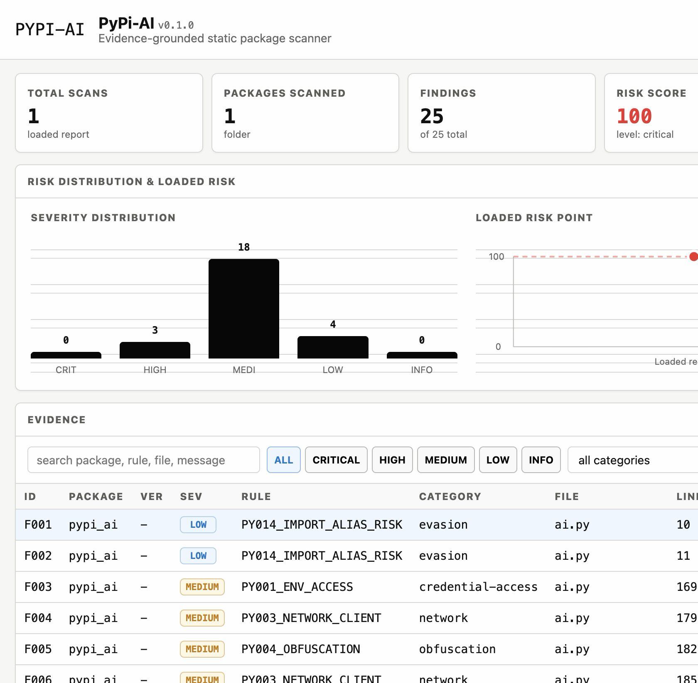

# PyPi-AI Dashboard

## Status

PyPi-AI includes a local single-screen dashboard for reviewer visualization.
It is implemented in this repository and opens directly from:

```text
dashboard/index.html
```

The dashboard is intentionally separate from the tested CLI core. It visualizes
real PyPi-AI JSON artifacts generated by `uv run pypi-ai scan ... --format json`.
The bundled default report is `dashboard/data/latest-report.json`, generated by
scanning the repository's own `src/pypi_ai` package.

Final screenshot:

```text
docs/final/dashboard-local.png
```



## Dashboard Scope

The dashboard is one screen only. It does not include a landing page, marketing
page, authentication flow, pricing page, documentation route, or any extra
navigation screen.

The dashboard visualizes:

- scan summary and risk score
- evidence table with severity, rule, package, path, line, confidence, and citations
- expanded finding details with snippets and evidence-grounded explanation text
- verified install status
- OSV SQLite cache status
- AI provider status for Ollama local, Ollama Cloud, Gemini, and deterministic fallback
- generated report artifacts
- branch readiness and quality gates

## Design Constraints

- Project name shown only as **PyPi-AI**.
- Monochrome black/white base.
- Restrained accent colors for logo, selected filters, severity, success, warning,
  and error states.
- No classroom-specific review wording.
- No real malware downloads or external API calls inside the dashboard.
- No fabricated finding rows; the evidence table is populated only from loaded
  PyPi-AI report JSON.

## Browser Verification

The dashboard was opened through the built-in browser at
`http://127.0.0.1:8123/dashboard/` and verified with the bundled report data:

- target: `src/pypi_ai`
- findings: `25`
- risk score: `100`
- risk level: `critical`
- default provider shown: `Ollama local`
