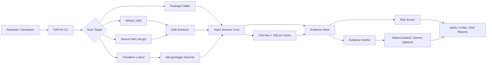
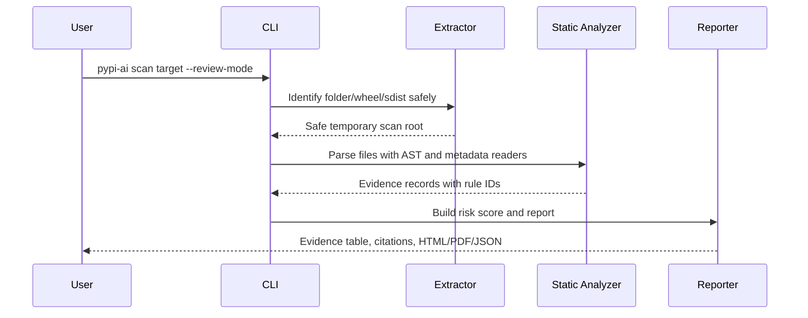
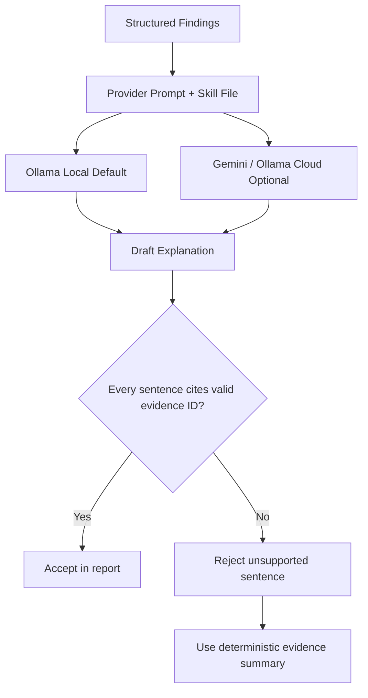
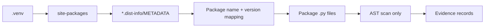
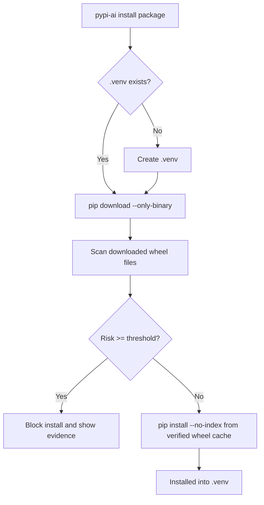

# PyPi-AI Defense Guide

## Project Identity

**PyPi-AI** is an evidence-grounded static scanner for suspicious Python packages.
It is the implementation and repository name for the **PyPI-Guardian**
final-year project concept.

Developers:

- VASANTH ADITHYA - 160123749049 - vasanthfeb13@gmail.com
- SAI GEETHIKA - 160123749302 - yedlasaigeethika37@gmail.com

Domain: AI + Cybersecurity, Software Supply Chain Security.

## What The Tool Does

PyPi-AI checks package folders, wheel archives, source distributions, and virtual
environment `site-packages` directories before a developer trusts that code. It
produces a risk score and evidence table with file paths, line numbers, snippets,
rule IDs, severity, and citations.

## Architecture



## Safety Argument

PyPi-AI is static-only:

- It does not install scanned packages.
- It does not import scanned modules.
- It does not execute `setup.py`.
- It does not run package functions.
- It extracts archives into scanner-owned temporary directories.

This makes the demo safe for faculty review and avoids putting real malware in
the repository.

## Static Scan Flow



## Evidence Grounding

Every finding is represented as a structured evidence record. AI explanations
must cite evidence IDs such as `[F001]`. The verifier rejects sentences that do
not cite known evidence IDs, which makes reports more defendable than free-form
LLM output.



## AI Provider Order

Ollama local is the default provider because it is privacy-friendly and can run
without sending code outside the machine. The implementation performs real
provider calls:

- Ollama local: HTTP POST to `http://localhost:11434/api/generate`.
- Ollama Cloud: signed-in `ollama run <model>` CLI path.
- Gemini: Gemini API with `GEMINI_API_KEY`.

If a provider fails, times out, or returns unsupported claims, PyPi-AI falls
back to deterministic evidence-only explanation and records the fallback reason.

Preferred Ollama Cloud model: `glm-5.2:cloud`.

Tested fallback on this machine: `minimax-m3:cloud`. During runtime QA,
`glm-5.2:cloud` reached Ollama Cloud but returned a subscription-required
`403 Forbidden`; `minimax-m3:cloud` successfully completed a live cloud check.

## Free Database Verification

PyPi-AI can query the free OSV.dev database for public PyPI advisories:

```bash
uv run pypi-ai scan examples/safe_packages/benign --check-osv
uv run pypi-ai database check requests
```

OSV responses are cached in local SQLite at
`.pypi-ai-cache/advisories.sqlite3` by default. This makes repeated package
checks faster and keeps a local verification trail for demos.

## `.venv` Scanning

`pypi-ai scan-venv .venv` locates `site-packages`, reads `.dist-info/METADATA`,
maps package names and versions to source folders, then scans `.py` files from
disk without importing those packages.



## Review Demo Script

```bash
uv run pypi-ai
uv run pypi-ai rules list
uv run pypi-ai examples list
uv run pypi-ai scan examples/safe_packages/benign --review-mode --show-evidence
uv run pypi-ai scan examples/safe_packages/env_network --review-mode --debug --trace-rules --show-evidence --show-citations --explain-risk
uv run pypi-ai scan examples/safe_packages/obfuscated --review-mode --debug --trace-rules --show-evidence --format all --output reports/obfuscated-demo
uv run pypi-ai scan examples/safe_packages/benign --check-osv --show-citations
uv run pypi-ai database check requests
uv run pypi-ai config init
uv run pypi-ai scan-venv .venv --review-mode --format json
uv run pypi-ai install requests --venv .venv --dry-run
uv run pypi-ai model test --provider ollama-cloud
uv run pypi-ai theme preview
```

## Verified Install Feature

`pypi-ai install <package>` is a Review 2 feature. It creates `.venv` when
missing, downloads wheels into a temporary directory, scans those wheels with the
same evidence engine, and installs only if the risk threshold is not reached.
The command uses wheels only and avoids installing source distributions by
default, because source builds can execute package build code.



## Report Defense Points

- A risk score is explainable because it is derived from weighted rule matches.
- A finding is defendable because it includes file path, line number, snippet,
  rule ID, severity, and category.
- Citations connect the implementation to CHASE, PyPA packaging specs, Python
  tarfile safety guidance, Gemini documentation, Ollama documentation, and public
  PyPI malware reporting.
- The project uses safe synthetic suspicious packages instead of committing real
  malware samples.
