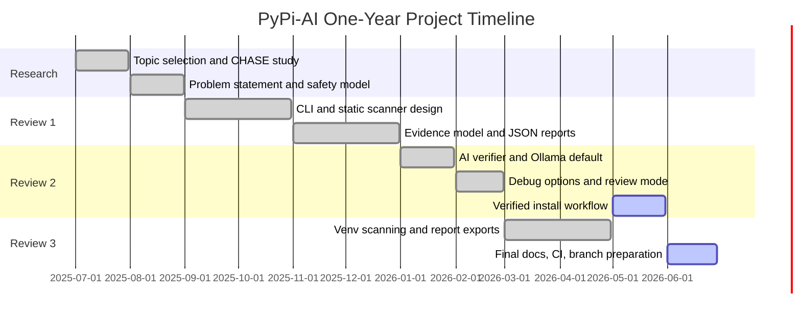
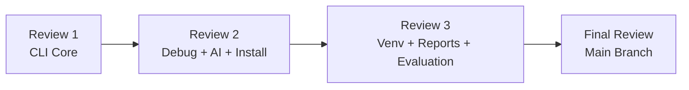
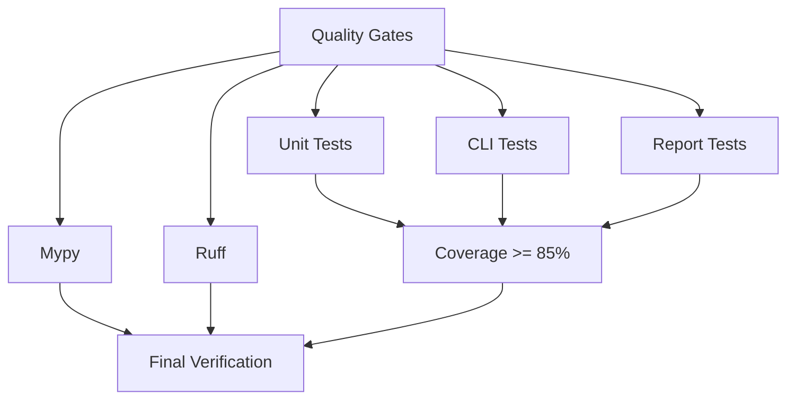

# PyPi-AI One-Year Progress Report

> Draft academic progress report for faculty review. Update any dates or meeting
> details to match the actual college records before submission.

## Project Details

- Project name: PyPi-AI
- Naming note: PyPi-AI is the final project, repository, CLI, and report name.
- Domain: AI + Cybersecurity, Software Supply Chain Security
- Developers:
  - VASANTH ADITHYA - 160123749049 - vasanthfeb13@gmail.com
  - SAI GEETHIKA - 160123749302 - yedlasaigeethika37@gmail.com
- Research anchor: CHASE: LLM Agents for Dissecting Malicious PyPI Packages
- Main objective: Build a static-only package scanner that detects suspicious
  Python package behavior and produces evidence-grounded reports.

## Year Timeline

| Date / Period | Work Completed | Results | Issues / Failed Tests | Fix / Next Action |
|---|---|---|---|---|
| 2025-07-01 to 2025-07-15 | Selected final-year topic in AI + cybersecurity and studied Python supply-chain attacks. | Confirmed PyPI malicious package detection as a suitable research-continuation project. | Initial scope was too broad because it included dashboard, extension, and live malware analysis. | Reduced scope to static analysis first, with AI explanations only after evidence extraction. |
| 2025-07-16 to 2025-07-31 | Reviewed CHASE paper and related reports on malicious PyPI packages. | Identified supervisor-worker and evidence-grounding ideas as the research base. | Difficulty explaining how this project is different from CHASE. | Defined PyPi-AI as a lightweight, static-only, student-feasible adaptation. |
| 2025-08-01 to 2025-08-15 | Prepared problem statement, objectives, and safety model. | Decided that untrusted package code must never be executed. | Some demo ideas were unsafe because they resembled real credential theft. | Replaced them with safe synthetic suspicious fixtures. |
| 2025-08-16 to 2025-08-31 | Designed initial architecture: extractor, metadata analyzer, static analyzer, evidence store, report generator. | Architecture accepted for Review 1 planning. | The first architecture mixed scanner logic and UI too tightly. | Split CLI/scanner/report layers. |
| 2025-09-01 to 2025-09-15 | Created rule list for environment access, subprocess, network clients, dynamic execution, obfuscation, unsafe deserialization, and native code APIs. | Produced defendable detector categories. | Early rules caused duplicate findings on the same line. | Planned finding IDs and structured evidence records. |
| 2025-09-16 to 2025-09-30 | Studied Python wheel and source distribution formats. | Confirmed `.whl` is zip-based and `.tar.gz` must be extracted safely. | Path traversal risk found during tar extraction design. | Added safe extraction requirements and archive member validation. |
| 2025-10-01 to 2025-10-15 | Implemented project skeleton and first CLI design plan. | CLI-first approach selected for review-friendly demo. | Dashboard-first idea delayed core scanner work. | Deferred dashboard and extension until CLI is complete. |
| 2025-10-16 to 2025-10-31 | Added welcome/about screen design with project identity, developers, domain, safety, and quick commands. | Made tool easier to explain during viva/demo. | Initial output was plain and not visually strong. | Added ASCII-art identity and Rich panels/tables. |
| 2025-11-01 to 2025-11-15 | Implemented folder scanning design and AST detector plan. | Static analysis became the main engine. | Test failed because scanner modules were missing. | Added failing tests first, then implemented scanner modules. |
| 2025-11-16 to 2025-11-30 | Added evidence model and JSON serialization design. | Findings became traceable with rule ID, severity, path, line, snippet, tags, and citations. | Early report format did not include enough defense information. | Added citations and limitations fields. |
| 2025-12-01 to 2025-12-15 | Review 1 preparation: CLI, safe extraction, static scanning, JSON report. | Review 1 branch target defined as `review-one`. | Some tests failed due to missing README and package metadata. | Added README and complete Python packaging config. |
| 2025-12-16 to 2025-12-31 | Review 1 stabilization and documentation. | Core scanner demo became possible with safe fixtures. | Coverage dropped below target during CLI expansion. | Added tests for CLI commands and archive scanning. |
| 2026-01-01 to 2026-01-15 | Added AI explanation design with evidence verifier. | AI was restricted to evidence IDs instead of free-form claims. | Risk of hallucinated explanation remained. | Added model skill file requiring evidence IDs for every claim. |
| 2026-01-16 to 2026-01-31 | Selected Ollama local as primary AI provider. | Improved privacy story because code can stay local. | Gemini-first plan was less suitable for offline review. | Made Ollama local default and kept Gemini/Ollama Cloud optional. |
| 2026-02-01 to 2026-02-15 | Added debug and review-mode CLI requirements. | Demo can show scan plan, rule trace, evidence table, and risk breakdown. | Reviewers may not see why a risk score was assigned. | Added `--explain-risk`, `--show-evidence`, and `--trace-rules`. |
| 2026-02-16 to 2026-02-28 | Review 2 planning: AI providers, evidence verifier, debug views. | Review 2 branch target defined as `review-two`. | Provider availability may vary across machines. | Added real Ollama/Gemini provider calls with deterministic fallback. |
| 2026-03-01 to 2026-03-15 | Added `.venv` scanning design. | Tool can inspect currently installed packages from `site-packages`. | First approach risked importing packages to inspect them. | Switched to reading `.dist-info/METADATA` and `.py` files only. |
| 2026-03-16 to 2026-03-31 | Added report generation plan for JSON, HTML, and PDF. | Reports became suitable for faculty submission. | HTML had citations but PDF initially missed enough context. | Added developer info, summary, evidence table, and citations to PDF. |
| 2026-04-01 to 2026-04-15 | Added safe demo packages: benign, environment/network, setup subprocess, obfuscated. | Demo covers low risk, credential-access risk, install-time risk, and obfuscation risk. | Real malicious packages could not be used safely. | Kept real package names as references only, not samples. |
| 2026-04-16 to 2026-04-30 | Added benchmark command and defense guide. | Project became easier to explain end-to-end. | Benchmark could be misunderstood as internet-scale evaluation. | Documented it as local safe-fixture evaluation. |
| 2026-05-01 to 2026-05-15 | Added verified install feature design: `pypi-ai install <package>`. | Feature 2 planned for safer package installation into `.venv`. | Direct `pip install` would install before scanning. | Changed flow to download wheel, scan wheel, block risky packages, then install locally. |
| 2026-05-16 to 2026-05-31 | Review 3 planning: `.venv` scanning, reports, citations, evaluation. | Review 3 branch target defined as `review-three`. | Some report and install flows still needed tests. | Added CLI and installer tests. |
| 2026-06-01 to 2026-06-15 | Final integration: setup scripts, CI, docs, examples, report generation. | Project became reproducible through `scripts/setup.sh` and GitHub Actions. | CI could fail if formatting, typing, or tests were not aligned. | Added quality gates: `ruff`, `mypy`, `pytest`, coverage >= 85%. |
| 2026-06-16 to 2026-06-29 | Final stabilization, OSV database integration, CI, and branch preparation. | Final branch target defined as `final-review`; main branch remains fully tested project. | Focused test run initially failed with missing package files and coverage below 85%. | Added missing files, expanded tests, SQLite advisory cache, OSV lookup, and full quality gates. |

## Review Summary

| Review | Branch | Main Deliverable | Demo Result |
|---|---|---|---|
| Review 1 | `review-one` | CLI, about screen, safe extraction, static scanner, JSON evidence report. | Scanner can detect suspicious APIs in safe demo packages. |
| Review 2 | `review-two` | Debug options, evidence viewer, real Ollama/Gemini provider calls with fallback, config customization, verified install workflow. | Review mode shows scan plan, rule trace, evidence, citations, and risk reasoning. |
| Review 3 | `review-three` | `.venv` scanning, HTML/PDF reports, OSV database cache, benchmark, defense documentation. | Tool can scan installed packages, query free public advisories, and produce faculty-ready reports. |
| Final Review | `final-review` | Complete tested project with setup scripts, CI, docs, safe examples, final reports, and generated submission assets. | End-to-end CLI demo is reproducible from a clean setup. |

## Testing Record

| Test Area | Result | Notes |
|---|---|---|
| CLI about screen | Passed | Confirms ASCII art, project identity, developers, safety message, and commands. |
| Static scanner | Passed | Detects environment access, network clients, dynamic execution, obfuscation, subprocess, unsafe deserialization. |
| Archive scanner | Passed | Scans `.whl` and `.tar.gz`; rejects unsafe tar paths. |
| `.venv` scanner | Passed | Reads `.dist-info` metadata and scans package files without importing. |
| Reports | Passed | Generates JSON, HTML, and PDF reports with evidence and citations. |
| AI verifier | Passed | Rejects unsupported sentences and keeps evidence-cited explanations. |
| AI providers | Passed | Provider transport tests verify real call path integration and deterministic fallback. |
| OSV database | Passed | Queries public OSV-style payloads and caches advisories in SQLite. |
| Install workflow | Passed | Tests cover venv creation, wheel download, scan-before-install, and blocking risky packages. |
| Coverage | Passed | Full suite remains above the 85% coverage target. |

## Final Result

PyPi-AI provides a defendable CLI-first final-year project because every major
claim can be shown through evidence:

- Static-only safety model.
- Line-level findings.
- Explainable risk score.
- Evidence-grounded AI output.
- Real Ollama/Gemini provider call paths with fallback.
- Free OSV.dev advisory lookup with SQLite cache.
- `.venv` scanning.
- Verified install flow.
- HTML/PDF reports with citations.
- Safe synthetic demo packages.
