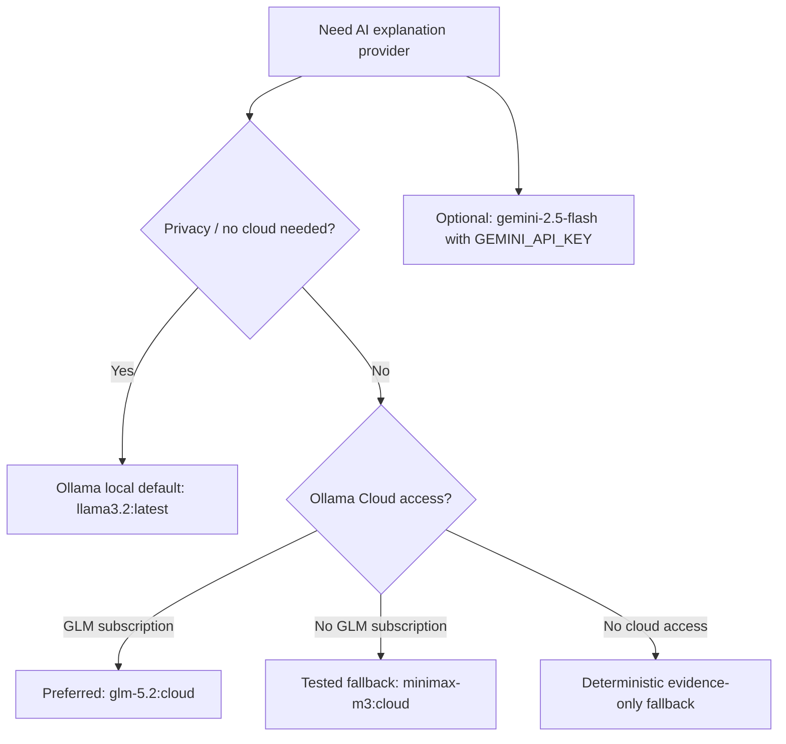

# PyPi-AI Runtime Debug Report

Date: 2026-06-29

Branch: `codex/runtime-debug-edgecases`

## Goal

Run PyPi-AI end to end, test Ollama Cloud access, check review-facing terminal
output, find edge cases, and improve the implementation before pushing a review
branch.

## Runtime Checks

| Check | Command | Result |
|---|---|---|
| Test suite baseline | `uv run pytest -q` | Final verification: 50 tests passed, 85.57% coverage. |
| Welcome screen | `uv run pypi-ai` | Passed. ASCII art, developers, safety model, target types, and demo commands are visible. |
| Review-mode scan | `uv run pypi-ai scan examples/safe_packages/obfuscated --review-mode --debug --trace-rules --show-evidence --explain-risk --format json` | Passed. Shows scan plan, rule trace, risk breakdown, evidence, and JSON. |
| Verified install dry run | `uv run pypi-ai install requests --venv .venv --dry-run` | Passed. Shows download-scan-install plan without installing. |
| GLM-5.2 cloud | `ollama run glm-5.2:cloud ...` | Failed with `403 Forbidden`; this account needs an Ollama subscription for that model. |
| Cloud fallback | `ollama run minimax-m3:cloud ...` | Passed. Returned the requested cloud-check text. |

## Edge Cases Found And Fixed

| Edge Case | Root Cause | Fix |
|---|---|---|
| `pyproject.toml` package name/version ignored | Metadata reader only checked `.dist-info/METADATA` and `PKG-INFO`. | Added static `pyproject.toml` parsing through `tomllib`. |
| Invalid `pyproject.toml` crashed scan | TOML parser exception was not caught. | Invalid TOML now falls back to folder-name metadata and continues static scan. |
| Missing package path produced raw exception | `ValueError` from scanner was not converted into a CLI error. | `pypi-ai scan missing-path` now shows a clean Typer error without traceback. |
| Missing `.venv` produced raw exception | `FileNotFoundError` from `.venv` scanner was not converted into a CLI error. | `pypi-ai scan-venv missing` now shows a clean Typer error without traceback. |
| Invalid report format silently printed JSON | Format validation only happened in report-writing paths. | Unsupported formats now fail cleanly before output. |
| Color system was not easy to demonstrate | No dedicated terminal-style preview existed. | Added `pypi-ai theme preview`. |

## Model Decision

## Color / Visibility Check

`pypi-ai theme preview` shows the terminal design language:

- Logo: bold white
- Options: cyan
- Success: green
- Warning: yellow
- Error: red
- Critical: bold red

The base interface stays monochrome, with color reserved for status, severity,
and important options.

## Final Recommendation

Use Ollama local for normal faculty demos. Use Ollama Cloud with
`glm-5.2:cloud` only after subscription access is enabled. Until then,
`minimax-m3:cloud` is the working cloud fallback on this machine.
