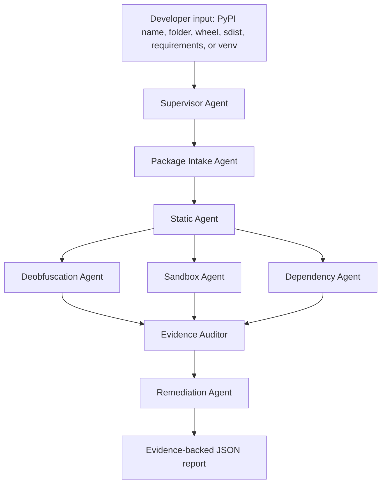

# PyPi-AI Agentic CHASE Continuation

## Paper-Level Title

**PyPi-AI Agent: Sandbox-Grounded Multi-Agent Framework for Sub-5-Minute Python Supply-Chain Risk Analysis**

Alternative title:

**PyPi-AI: A CHASE-Inspired Multi-Agent and Sandbox-Grounded Framework for Malicious PyPI Package Behavior Analysis**

## Research Position

The stable PyPi-AI project is an evidence-grounded static scanner. This branch extends it
into a CHASE-inspired continuation: a bounded Plan-and-Execute agent workflow that
normalizes package inputs, scans static evidence, optionally probes behavior inside a
Docker sandbox, checks dependency intelligence, audits evidence IDs, and returns developer
remediation guidance.

The key continuation is not to copy CHASE. CHASE focuses on malicious package
dissection. PyPi-AI Agent focuses on developer-side supply-chain decisions:

- should this package be installed?
- should it be blocked?
- should it be reviewed manually?
- should it be isolated in a fresh virtual environment?
- what evidence supports that decision?

## Safety Statement

PyPi-AI does not execute untrusted package code on the host machine. Behavioral analysis
is performed only inside a disposable, resource-limited Docker sandbox with no real
credentials, no host secrets, strict timeout, restricted network policy, and evidence-only
telemetry collection.

## Implemented Branch Structure

```text
src/pypi_ai/
  agents/
    supervisor.py
    intake_agent.py
    static_agent.py
    sandbox_agent.py
    deobfuscation_agent.py
    dependency_agent.py
    remediation_agent.py
    evidence_auditor.py

  sandbox/
    runner.py
    policy.py
    telemetry.py
    docker_client.py

  telemetry/
    fs_events.py
    process_events.py
    network_events.py
    import_events.py

docker/
  pypi-ai-sandbox/
    Dockerfile
    entrypoint.py
```

## Agent Workflow



## CLI

```bash
pypi-ai agent scan requests
pypi-ai agent scan ./some_package --no-sandbox
pypi-ai agent scan ./package.whl
pypi-ai agent scan ./package.tar.gz
pypi-ai agent scan-venv .venv
pypi-ai agent batch requirements.txt --max-package-time 300
pypi-ai agent sample-live --sample-size 3
```

`sample-live` selects packages at runtime from the public top-PyPI package dataset,
downloads wheels only, and statically scans those wheels without installing them.

## Sub-5-Minute Budget

| Stage | Budget |
|---|---:|
| Intake + metadata | 20 sec |
| Static scan + deobfuscation | 60 sec |
| OSV/dependency intelligence | 30 sec |
| Docker sandbox behavior probe | 120 sec |
| Agent reasoning + evidence audit | 45 sec |
| Report/remediation generation | 25 sec |
| Total | 300 sec |

Timeouts produce partial or inconclusive reports instead of pretending the analysis is
complete.

## Research Anchors

- CHASE: LLM Agents for Dissecting Malicious PyPI Packages, arXiv:2601.06838.
  https://arxiv.org/abs/2601.06838
- DySec: A Machine Learning-based Dynamic Analysis for Detecting Malicious Packages in
  PyPI Ecosystem, arXiv:2503.00324. https://arxiv.org/abs/2503.00324
- Docker container run reference. https://docs.docker.com/reference/cli/docker/container/run/
